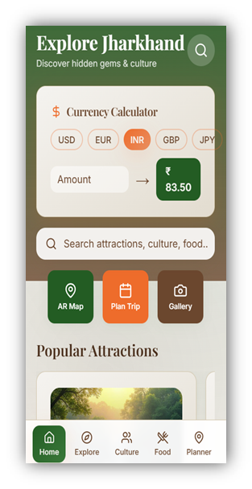
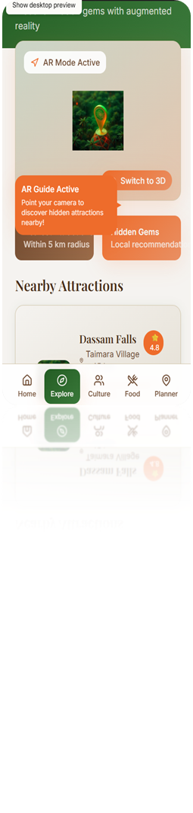

# 🌿 DurgamPath – Smart Digital Tourism Platform for Jharkhand  

> Empowering Jharkhand’s tourism with AI, Blockchain, and AR/VR – A smart and community-driven digital platform.  

## ✨ Key Features  

- 🎯 Personalized Itineraries – AI-driven custom travel plans  
- 🗺️ AR/VR Interactive Maps – Virtual exploration & AR navigation  
- 💬 Multilingual AI Chatbot – Tourist assistance in multiple languages  
- 🔐 Blockchain-Secured Payments – Safe and transparent transactions  
- 📡 Offline Navigation & SOS – Travel safety & emergency alerts  
- 🏡 Community Marketplace – Homestays, handicrafts, artisans’ direct selling  
- 📊 Government Dashboard – Real-time data for tourism policies  

## 🚀 Live Demo  

🔗 [Explore DurgamPath](https://jharkhand-tourism-app.lovable.app/)  

## 📑 Project Presentation  

📂 [Download PPT](DurgamPath.pptx)  

## 📱 App Screenshots  

| Login Screen | Home Screen | Map Screen | Explore | Culture | Food | Planner | AI - Suggestions |
|--------------|-------------|------------|---------------------|  
|  |  ||  |  |  |  |

---

## 🛠️ Tech Stack  

- Frontend: React + Vite + TailwindCSS + shadcn/ui  
- Backend: Node.js / Express (planned)  
- AI: Multilingual Chatbot  
- Blockchain: Secure Payments Integration  
- AR/VR: Immersive Tourism Experience  
- Cloud: Scalable Architecture  

